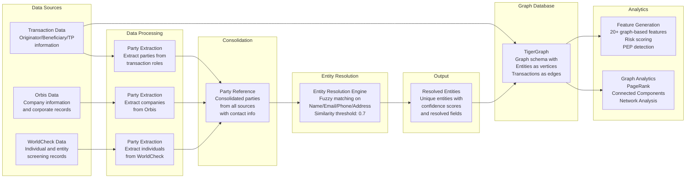

# Entity Resolution eXperiment with TigerGraph

Disclaimer: Entity Resolution eXperiment (ERX) is my personal research during my free time and there is no checks or gaurantee. Please do your own checks if you are using this code for your research and projects. All sample data and examples are arbitrary and synthetic data I generated. No personally identifiable inforamtion is in this project. 

Objective: This project aims to combine fuzzy matching, graph-based analysis, and feature generation for AML (Anti-Money Laundering) applications.

## Overview

This system provides three main components:

1. **Entity Resolution**: Identifies and groups similar records into entities with proper classification
2. **Graph Generation**: Creates a graph in TigerGraph with entities as nodes and transactions as edges
3. **Feature Generation**: Computes graph-based features like PageRank, centrality measures, and risk scores

## Features

- **Multi-field Entity Resolution**: Uses fuzzy matching on names, emails, phones, and addresses
- **Entity Classification**: Automatically classifies entities as individuals ('ind') or businesses ('biz')
- **PEP Detection**: Identifies Politically Exposed Persons
- **Risk Scoring**: Calculates risk scores based on various factors
- **Graph Analytics**: Leverages TigerGraph for advanced graph algorithms
- **Feature Engineering**: Generates 20+ graph-based features for machine learning
- **Comprehensive Reporting**: Detailed summaries and risk analysis

## Architecture


```

## Quick Start

### 1. Generate Sample Data

First, create sample data to test the system:

```bash
python src/data_synthesizer/generate_sample_data.py
```

This creates:
- `data/sample_customer_large.csv` (500K customer records)
- `data/sample_trnx_large.csv` (1M transaction records)
- `data/sample_orbis_large.csv` (100K Orbis records)
- `data/sample_wc_large.csv` (100K WorldCheck records)

### 2. Run Entity Resolution Only

For testing without TigerGraph:

```bash
python example_usage.py --entity-only
```

### 3. Run Full Pipeline

For complete functionality with TigerGraph:

```bash
python example_usage.py
```


## Generated Features

The system generates the following categories of features:

### Graph-Based Features
- **PageRank Score**: Entity importance in the transaction network
- **Connected Component ID**: Community membership
- **Degree Centrality**: Number of direct connections

### Transaction-Based Features
- **Total Transaction Amount**: Sum of all transactions
- **Transaction Count**: Number of transactions
- **Average Transaction Amount**: Mean transaction value
- **Amount Variance**: Variability in transaction amounts
- **Suspicious Pattern Score**: Detection of structuring patterns
- **Unique Currencies/Countries**: Geographic and currency diversity

### Network-Based Features
- **Direct/Indirect Connections**: Network reach
- **PEP Connections**: Connections to politically exposed persons
- **High-Risk Connections**: Connections to high-risk entities
- **Network Density**: Clustering coefficient

### Temporal Features
- **Activity Recency**: Days since last transaction
- **Transaction Trend**: Increasing/decreasing activity
- **Recent vs Old Transactions**: Temporal distribution

## Output Files

The pipeline generates several output files:

- `output/entities_with_features.csv`: Complete entity data with all features
- `output/features.csv`: All generated features
- `output/entity_mapping.json`: Mapping from customer names to entity IDs
- `output/pipeline_summary.json`: Comprehensive pipeline summary
- `output/resolved_entities.csv`: Entity resolution results


## Entity Resolution Logic and Details

The following rules and logic are used for entity resolution:

### 1. Preprocessing
- **Names:** Remove extra spaces and punctuation, convert to lowercase (if configured).
- **Emails:** Convert to lowercase (if configured).
- **Phones:** Remove all non-digit characters (if configured).
- **Addresses:** Normalize spaces and optionally convert to lowercase.

### 2. Similarity Calculation
For each pair of records, the following fields are compared:
- **Name:** Uses a combination of fuzzy matching algorithms (e.g., token sort ratio, partial ratio, Levenshtein distance) with configurable weights.
- **Email:** If emails are identical, similarity is 1.0. Otherwise, compares local part and domain separately, giving higher weight to domain matches.
- **Phone:** If phone numbers are identical, similarity is 1.0. If the last 10 digits match, similarity is 0.9. Otherwise, uses fuzzy ratio.
- **Address:** Uses fuzzy matching algorithms (e.g., token set ratio, partial ratio) with configurable weights.

A weighted average of these similarities is computed using the following default weights:
- Name: 0.4
- Email: 0.3
- Phone: 0.2
- Address: 0.1

### 3. Clustering/Grouping Records
- **First pass:** Records with exact matches on key fields (email or phone) are grouped together.
- **Second pass:** Remaining records are compared to existing clusters using the overall similarity score. If the average similarity to a cluster exceeds the configured threshold (default: 0.80), the record is added to that cluster. Otherwise, a new cluster (entity) is created for the record.

### 4. Entity Attributes and Classification
- **Entity Type:** If any record in the cluster contains business-related keywords (e.g., inc, corp, ltd, llc, company), the entity is classified as a business (`biz`). Otherwise, it is classified as an individual (`ind`).
- **PEP Status:** If any record’s name contains keywords like senator, minister, president, etc., the entity is flagged as a Politically Exposed Person (`pep_ind`).
- **Confidence Score:** For single-record entities: 0.7. For multi-record entities: average similarity within the cluster, boosted for larger clusters.
- **Risk Score:** Increased if the entity has multiple records or if names/emails contain suspicious patterns (e.g., “test”, “fake”, “dummy”).
- **Primary Fields:** The most representative name, email, phone, and address are selected (e.g., longest name, first email, etc.).

### 5. Output
Each entity contains:
- `entity_id`, `entity_type`, `pep_ind`, `confidence`, `risk_score`, `primary_name`, `primary_email`, `primary_phone`, `primary_address`, `record_count`, `sources`, and all associated records.

### 6. Graph Databases
Among different graph databases I chose Tiger Graph for scalability reasons. See the [comparison of graph databases](data/graph_database_comparison.xlsx) for more information. 


## Support & License

This is a personal research project and there is no support or licensing


