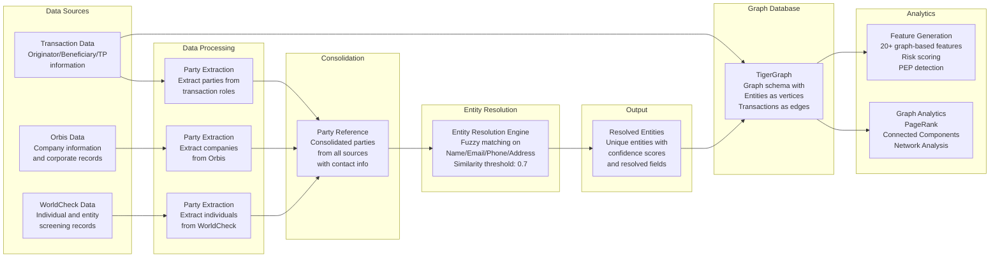

# Entity Resolution eXperiment with TigerGraph

Disclaimer: Entity Resolution eXperiment (ERX) is my personal research during my free time and there is no checks or gaurantee. Please do your own checks if you are using this code for your research and projects. All sample data and examples are arbitrary and synthetic data I generated. No personally identifiable inforamtion is in this project. 

Objective: This project aims to combine fuzzy matching, graph-based analysis, and feature generation for AML (Anti-Money Laundering) applications.

## Overview

This system provides three main components:

1. **Entity Resolution**: Identifies and groups similar records into entities with proper classification from multiple source systems
2. **Graph Generation**: Creates a graph in TigerGraph with entities as nodes and transactions as edges
3. **Feature Generation**: Computes graph-based features like PageRank, centrality measures, and risk scores

The system processes data from three source systems:
- **Transaction Data** (trnx): Originator, beneficiary, and third-party information
- **Orbis Data** (orbis): Company information and corporate records
- **WorldCheck Data** (WC): Individual and entity screening records

## Features

- **Multi-source Entity Resolution**: Processes parties from transaction, Orbis, and WorldCheck data
- **Optional Field Handling**: Gracefully handles missing email, phone, and address data
- **Cross-source Entity Mapping**: Maintains separate entity records for same entity across sources
- **Entity Classification**: Automatically classifies entities as individuals or businesses
- **PEP Detection**: Identifies Politically Exposed Persons
- **Risk Scoring**: Calculates risk scores based on various factors
- **Graph Analytics**: Leverages TigerGraph for advanced graph algorithms
- **Feature Engineering**: Generates 20+ graph-based features for machine learning
- **Comprehensive Reporting**: Detailed summaries and risk analysis

## Architecture

<style>
.mermaid {
    background: transparent !important;
}
.mermaid svg {
    max-width: 100%;
    height: auto;
}
/* Hide Mermaid controls */
.mermaid .mermaid-controls,
.mermaid .mermaid-toolbar {
    display: none !important;
}
</style>



## Quick Start

### 1. Generate Sample Data

First, create sample data to test the system:

```bash
python src/data_synthesizer/generate_sample_data.py
```

This creates:
- `data/sample_trnx_large.csv` (1M transaction records with 42 fields)
- `data/sample_orbis_large.csv` (100K Orbis company records)
- `data/sample_wc_large.csv` (100K WorldCheck screening records)

### 2. Generate Party Reference Data

Create consolidated party data from the three source systems:

```bash
python src/data_synthesizer/generate_party_ref_large.py
```

This creates:
- `data/party_ref_large.csv` (consolidated parties from all sources)

### 3. Run Entity Resolution

Process party reference data to identify and group similar entities:

```bash
python src/run_entity_resolution_optimized.py
```

This creates:
- `data/entity.csv` (resolved entities with confidence scores)

### 4. Run Full Pipeline

For complete functionality with TigerGraph:

```bash
python example_usage.py
```

## Generated Features

The system generates the following categories of features:

### Graph-Based Features
- **PageRank Score**: Entity importance in the transaction network
- **Connected Component ID**: Community membership
- **Degree Centrality**: Number of direct connections

### Transaction-Based Features
- **Total Transaction Amount**: Sum of all transactions
- **Transaction Count**: Number of transactions
- **Average Transaction Amount**: Mean transaction value
- **Amount Variance**: Variability in transaction amounts
- **Suspicious Pattern Score**: Detection of structuring patterns
- **Unique Currencies/Countries**: Geographic and currency diversity

### Network-Based Features
- **Direct/Indirect Connections**: Network reach
- **PEP Connections**: Connections to politically exposed persons
- **High-Risk Connections**: Connections to high-risk entities
- **Network Density**: Clustering coefficient

### Temporal Features
- **Activity Recency**: Days since last transaction
- **Transaction Trend**: Increasing/decreasing activity
- **Recent vs Old Transactions**: Temporal distribution

## Output Files

The pipeline generates several output files:

- `data/entity.csv`: Resolved entities with confidence scores and resolved fields
- `output/entities_with_features.csv`: Complete entity data with all features
- `output/features.csv`: All generated features
- `output/entity_mapping.json`: Mapping from party IDs to entity IDs
- `output/pipeline_summary.json`: Comprehensive pipeline summary

## Entity Resolution Logic and Details

The system processes party data from three source systems and applies the following rules:

### 1. Data Sources and Party Extraction
- **Transaction Data**: Extract parties from `originator_name`, `beneficiary_name`, `TP_originator_name`, `TP_beneficiary_name`
- **Orbis Data**: Extract parties from `company_name`
- **WorldCheck Data**: Extract parties from `full_name`

### 2. Party Reference Schema
Each party record contains:
- `party_id`: Unique identifier
- `name`, `email`, `phone`, `address`, `country`: Contact information (optional fields)
- `accounts_list`: Account numbers (only for transaction source)
- `source_system`: Origin system (trnx, orbis, WC)
- `source_index_list`: References to original source records

### 3. Preprocessing
- **Names:** Remove extra spaces and punctuation, convert to lowercase
- **Emails:** Convert to lowercase, handle NaN values
- **Phones:** Remove all non-digit characters, handle NaN values
- **Addresses:** Normalize spaces and convert to lowercase, handle NaN values

### 4. Similarity Calculation
For each pair of parties, the following fields are compared with weighted scoring:
- **Name:** Fuzzy matching (40% weight)
- **Email:** Exact match gets 1.0, otherwise fuzzy matching (30% weight)
- **Phone:** Exact match gets 1.0, otherwise fuzzy matching (20% weight)
- **Address:** Fuzzy matching (10% weight)

### 5. Entity Resolution Process
- **Clustering:** Group parties with similarity ≥ 0.7 into entities
- **Cross-source Logic:** Each entity represents one real-world entity from one source system
- **Same entity across sources:** Creates separate entity records (no cross-source deduplication)
- **Within-source Deduplication:** Aggregates multiple references to the same entity within a source

### 6. Entity Output Schema
Each resolved entity contains:
- `entity_id`: Unique entity identifier
- `party_ids`: List of party IDs belonging to this entity
- `confidence_score`: Resolution confidence (0.0-1.0)
- `resolved_name`, `resolved_email`, `resolved_phone`, `resolved_address`, `resolved_country`: Best available values
- `source_systems`: List of source systems this entity appears in
- `records`: Complete party data as JSON array

### 7. Graph Databases
Among different graph databases I chose Tiger Graph for scalability reasons. See the [comparison of graph databases](data/graph_database_comparison.xlsx) for more information. 

## Support & License

This is a personal research project and there is no support or licensing

<!--
## Roadmap
[ ] Support for additional data sources
[ ] Machine learning model integration
[ ] Integraiton to TigerGraph
[ ] API endpoints
[ ] Docker containerization -->


